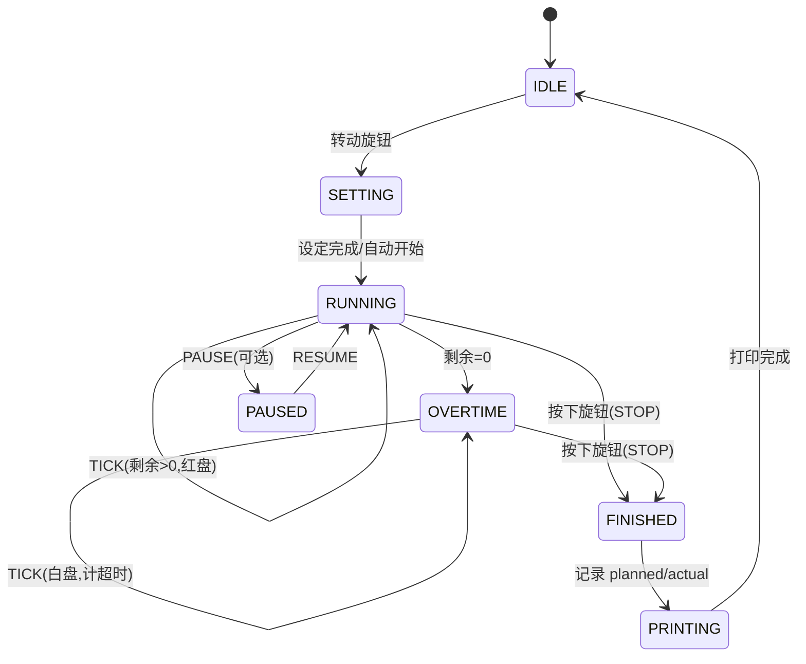

# 时光小印 · TimePrint — 初步技术 Spec v0.1

> 基于 ESP32 的智能可视化计时器。把「轻量型时间管理 + 情绪关怀」的产品概念落地成可运行的软硬件系统。
> 核心理念:把一段专注时间「可视化」,并在结束时打印一张「预计用时 vs 实际用时」的便签,帮助用户建立对时间的感知与估算能力。

---

## 1. 项目概述

| 项 | 内容 |
|---|---|
| 形态 | 桌面计时器,正面圆形可视化表盘(Time-Timer 风格,色块随时间收缩),底部打印便签 |
| MCU | ESP32(支持 WiFi + BLE) |
| 供电 | 内置 LiPo,USB-C 充电(对应设计图背面充电口) |
| 控制方式 | ① 物理旋钮(单机离线可用) ② WiFi(AP 直连 / STA 配网) ③ BLE + 安卓 App |
| 输出 | 圆形表盘显示 / 蜂鸣反馈 / 热敏打印便签(可选模块) |
| 设计原则 | **单机必须完整可用**,WiFi/BLE/服务端都是叠加增强,而非依赖 |

---

## 2. 核心交互模型(忠实还原设计图)

来自设计图标注的交互流程,作为状态机的需求基准:

1. **转动旋钮**预设时间 → 表盘开始转动 → 表示「开始」
2. 计时中,红色色块随剩余时间收缩(可视化进度)
3. **超过预设时间**后表盘仍转动,**由红盘切换到白盘**(超时态,视觉上明确区分)
4. 任务完成后**轻按旋钮** → 表盘停转 → 表示「停止」
5. 停止后:记录预计用时 & 实际用时 → **打印便签**(含笑脸,可收集对比)
6. 空白便签纸从**顶部细长扣口**塞入,从**底部**打印吐出

> 注意:旋钮同时承担「设定时间」「转动=开始」「按下=停止确认」三个动作 —— 这正好对应一颗 **带按键的旋转编码器 EC11**。

---

## 3. 系统架构(最重要的部分)

**事件驱动核心 + 可插拔 I/O(类 HAL 抽象)。** 核心状态机不关心事件来源与效果去向。



### 3.1 核心:`TimerCore`(可移植,纯逻辑)
- 状态:`IDLE / SETTING / RUNNING / OVERTIME / PAUSED / FINISHED / PRINTING`
- 输入事件(**与来源无关**):`SET_TIME(min)`、`START`、`PAUSE`、`RESUME`、`STOP`、`RESET`、`TICK(1s)`
- 输出效果(**与去向无关**):`renderDial(total, remaining, overtimeFlag)`、`feedback(type)`、`printSlip(planned_s, actual_s, overrun_s)`、`broadcastState(state)`
- **可在 PC 上做单元测试**(PlatformIO `native` env),不依赖任何硬件。

### 3.2 输入 adapters(只负责"发 event")
- **Manual**:EC11 编码器(转=SET_TIME/START,按=STOP) + 可选额外按键
- **WiFi**:HTTP REST + WebSocket 收命令
- **BLE**:GATT characteristic 写入
- **(可选)电位器**:若拆开的计时器旋钮是电位器,用 ADC 读取 → 映射为 SET_TIME(直接替换 EC11 adapter)

### 3.3 输出 adapters(只负责"消费 effect")
- **Display**:GC9A01 圆形 LCD(软件绘制 Time-Timer 表盘,红/白盘切换)
- **Printer**:UART 热敏打印模块(**可选**;未接时为串口日志空实现)
- **Buzzer**:无源蜂鸣片
- **Status**:WebSocket push / BLE notify(给网页和 App 实时推状态)

> 这套解耦让你:**没打印机先用串口空实现调通核心** → 加显示 → 加 WiFi → 加 BLE,每一步都不碰核心。

---

## 4. 功能需求(对应你的三点)

| ID | 需求 | 对应你的诉求 |
|---|---|---|
| FR1 | 完全离线单机可用:旋钮设定/开始/停止全流程 | ①手动触发 |
| FR2 | 圆形可视化表盘,红→白超时切换 | 产品核心 |
| FR3 | 完成后打印「预计 vs 实际」便签;**打印模块可选**,缺失时降级为日志 | ①无打印机先调试 |
| FR4 | WiFi:AP 模式(自带配置/控制网页,无需路由器) + STA 配网模式 | ②多管理模式 / 单机可用 |
| FR5 | BLE GATT 控制 + 配套安卓 App | ③蓝牙 + App |
| FR6 | (可选)服务端:历史同步 / 远程控制 / OTA;**非必需** | ②可选服务端 |
| FR7 | LiPo + USB-C 充电 | 设计图背面 |
| FR8 | 本地记录历史(预计 vs 实际),支持对比统计 | 产品理念 |

---

## 5. 硬件选型 / BOM(MVP)

| 子系统 | MVP 方案 | 备注 / 备选 |
|---|---|---|
| MCU | ESP32(**需确认型号**,见 §16) | BLE 需要 classic / C3 / S3;S2 无蓝牙 |
| 表盘 | GC9A01 1.28" 圆形 LCD 240×240(SPI) | 备选:WS2812 60 灯 LED 环(复古感);或电机驱动实体盘(最难) |
| 设定输入 | EC11 带按键旋转编码器 | 1:1 还原"转=设定/开始,按=停止"交互 |
| 打印 | 58mm TTL 热敏打印模块(UART,ESC/POS) | **Phase 4**;峰值电流大,见 §13 |
| 蜂鸣 | 无源蜂鸣片 | 反馈/提示音 |
| 电源 | LiPo 1500–2000mAh + 充电管理(TP4056/IP5306)+ 升压 5V | USB-C;打印机峰值 1.5–2A |
| 外壳 | 3D 打印(你有 PrintFarm,可直接出) | 还原设计图比例:约 7×4.8×12cm |

---

## 6. 关于「魔改买来的计时器」的分析

你拆开后会落到下面三种情况之一,对应策略:

| 内部实现 | 能否复用 | 策略 |
|---|---|---|
| **纯机械钟芯**(发条/齿轮) | 无电气读数 | 硬数字化(加磁铁+霍尔/光电码盘)= 等于自己造编码器,**不划算**,直接用 EC11 |
| **电位器旋钮** | ✅ 完美 | 取电位器中间抽头 → ESP32 ADC → 映射 SET_TIME。即你说的"当电阻器用",直接做成输入 adapter |
| **数字芯片 + 按键 + 蜂鸣** | 部分 | 蜂鸣输出可作为"到时触发"信号;但用它设定时间手感差 |

**结论:MVP 不被它阻塞**。先上 EC11 把交互跑通;拆开后若是电位器再无缝替换(架构支持热插拔输入)。最差情况你说的"当电阻器用"在架构里就是一个 30 行的 ADC adapter。

---

## 7. 固件技术栈

- **框架**:PlatformIO + Arduino-ESP32(快速迭代),用 FreeRTOS task 做并发(UI / WiFi / BLE / 打印各一个 task)。需要更底层控制时可迁移 ESP-IDF。
- **显示**:LVGL 或 TFT_eSPI 绘制圆形表盘
- **WiFi**:ESPAsyncWebServer(REST + WebSocket)+ captive portal 配网
- **BLE**:**NimBLE-Arduino**(比默认 BLE 省 RAM/Flash,与 WiFi 共存更好)
- **JSON**:ArduinoJson
- **打印**:Adafruit_Thermal 或自写 ESC/POS
- **持久化**:NVS 存配置;LittleFS 存历史日志(JSON)

> ESP32 经典款 WiFi/BLE 共享 2.4G 单射频,本应用一般不需要两者同时高吞吐(配置走 BLE *或* WiFi),共存压力不大。

---

## 8. 统一通信协议(WiFi 与 BLE 共用)

**一套 schema,多种 transport**,呼应"输入与来源无关"。

**命令(Client → Device)**
```json
{ "cmd": "set",    "minutes": 25 }
{ "cmd": "start" }
{ "cmd": "pause" }
{ "cmd": "resume" }
{ "cmd": "stop" }
{ "cmd": "reset" }
{ "cmd": "config", "data": { "ssid": "...", "pass": "...", "buzzer": true } }
```

**状态(Device → Client,WS notify / BLE notify 推送)**
```json
{
  "state": "running",     // idle|setting|running|overtime|paused|finished|printing
  "planned_s": 1500,
  "remaining_s": 842,
  "elapsed_s": 658,
  "overtime_s": 0
}
```

---

## 9. WiFi 模式设计

- **AP 模式(默认/单机)**:开机若无已保存网络,启动热点 `TimePrint-XXXX`,手机连上后 captive portal 弹出控制+配置页。**无路由器也能完整使用**。
- **STA 模式**:配网后连入家庭 WiFi,局域网内通过网页/App(同一套 REST+WS)控制。
- **控制网页**:单页应用,内嵌固件,展示实时表盘(WS 推送)+ 设定/开始/停止 + 历史列表。

---

## 10. BLE 设计(GATT)

自定义 Service(自分配 128-bit UUID),三个 characteristic:
- `CMD`(Write):写入 §8 命令
- `STATE`(Notify):推送 §8 状态
- `CONFIG`(Read/Write):设备配置

安卓端用同一套 JSON over characteristic,逻辑与 WiFi 端复用。

---

## 11. 安卓 App(Phase 3,栈待定)

- MVP 功能:BLE 扫描连接 → 设定/开始/停止 → 历史曲线(预计 vs 实际趋势)
- 栈选择(到 Phase 3 再定):
  - **Flutter**(`flutter_blue_plus`):一套代码、迭代快,但 BLE 有平台坑
  - **原生 Kotlin**:BLE 最稳,工作量略大
- 倾向:看你更想"快"还是"稳",默认 Flutter 起步,遇到 BLE 可靠性问题再评估。

---

## 12. 服务端(可选,Phase 5+)

- 仅用于:云端历史同步 / 远程控制 / OTA 固件推送 / 多设备
- 栈:FastAPI + PostgreSQL(+ 可选 MQTT broker 做设备长连)
- **铁律:设备脱离服务端必须完整可用**。

---

## 13. 电源设计要点

- 热敏打印瞬时电流 **1.5–2A**(打印行时拉满),普通小升压扛不住。
- 方案:打印机供电走独立的大电流 5V 升压 / 直接吃充电输入轨,加大容量去耦电容(1000µF+),避免打印时 MCU 掉电复位。
- LiPo 容量按"打印峰值 + WiFi/BLE 常态"留余量。

---

## 14. 数据与持久化

- 配置:NVS(WiFi 凭据、蜂鸣开关、默认时长)
- 历史:LittleFS 中 JSON 追加 `{ts, planned_s, actual_s, overrun_s}`,供网页/App 拉取做"估算准确度"统计(产品核心价值)。

---

## 15. 开发路线图(Claude Code 友好,分阶段)

| Phase | 目标 | 完成即验证 |
|---|---|---|
| **P0 骨架** | `TimerCore` 状态机 + native 单元测试;串口命令驱动状态流转(打印=串口日志空实现) | ✅ FR1 调试、FR3 降级 |
| **P1 显示+输入** | GC9A01 表盘绘制(红→白)+ EC11 adapter;离线全流程跑通 | ✅ FR1、FR2 |
| **P2 WiFi** | AP captive portal 配网 + STA + 控制网页(REST+WS 实时表盘) | ✅ FR4 |
| **P3 BLE+App** | NimBLE GATT + 安卓 App MVP | ✅ FR5 |
| **P4 打印** | 热敏打印 adapter + 便签排版(预计/实际/笑脸)+ 电源加固 | ✅ FR3 |
| **P5 打磨** | 历史统计 / OTA / 可选服务端 / 电位器输入 / 3D 打印外壳 / 电池集成 | ✅ FR6-8 |

> P2 与 P3 可并行;打印模块到货后可随时插入(不阻塞核心)。

---

## 16. 仓库结构建议

```
timeprint/
  firmware/            # PlatformIO
    src/
      core/            # TimerCore(可移植,无硬件依赖)
      hal/             # display / input / printer / buzzer adapters
      net/             # wifi / ble / web / protocol
      main.cpp
    test/              # native 单元测试(跑在 PC 上)
    platformio.ini
  app-android/
  server/              # 可选 FastAPI
  hardware/            # 原理图 / BOM / 3D 外壳
  docs/                # 本 spec
```

---

## 17. 待你确认的关键决策

> 这几个会实质影响 spec,确认后即可开 P0。我已给出默认推荐,不回也能先开干。

1. **ESP32 型号?** 具体哪块开发板?(BLE 需要 classic / C3 / S3,**S2 无蓝牙**)
2. **表盘方案?** 默认推荐 GC9A01 圆形 LCD;备选 LED 环 / 实体电机盘。
3. **设定输入?** 默认 EC11 编码器(还原原始交互);是否要等拆开计时器后改电位器方案?
4. **(P3 再定)安卓 App 栈?** Flutter 还是原生 Kotlin?
